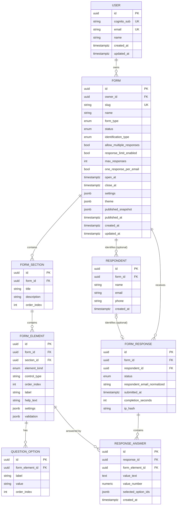

# Formcraft — Database Design

PostgreSQL. Relational core for real relationships; JSONB only for genuinely flexible, control-specific configuration. See ADR-002.

## 1. Entity-Relationship Diagram

## 2. Design decisions worth calling out

### 2.1 `FormElement` unifies content components and questions

CLAUDE.md's core domain model names `FormQuestion`; content components (Heading, Paragraph, Instruction, Image, Divider) are listed separately and are not given their own entity. Both content blocks and questions live in one ordered list per section on the builder canvas, so they need one shared ordering/ownership model. **Proposal (flagged for confirmation):** a single `FormElement` table with `element_kind` (`content` | `question`) and `control_type` discriminating the specific block/control. `validation` is only meaningful when `element_kind = question`. This avoids two parallel ordering systems within a section and keeps the generic-control-model rule (§17 of CLAUDE.md) intact. Listed as an open question in `docs/ARCHITECTURE.md`.

### 2.2 `QuestionOption` stays relational, not JSONB

Options need stable, addressable IDs for two reasons: (a) response-answer aggregation (frequency distribution per option) must survive a label edit after responses exist, and (b) future conditional logic (`IF owns_vehicle = YES THEN ...`) branches on a specific option, which is far cleaner against a row ID than a JSONB array index. This is the one control-related concept promoted out of `settings` JSONB into its own table.

### 2.3 `ResponseAnswer` uses typed columns, not one generic JSONB value

`value_text` / `value_number` / `selected_option_ids` instead of a single JSONB `value` column. This lets Postgres compute `AVG`/`MIN`/`MAX` natively for Number and Rating controls without JSONB casts scattered through every analytics query — directly serves the Results & Analytics requirement (CLAUDE.md §32, §44 performance).

### 2.4 Respondent is scoped per-form, not a cross-form identity

`Respondent.form_id` ties a respondent record to one form. Formcraft does not build a cross-form respondent profile in MVP — simpler, and avoids an implicit identity-graph/privacy surface nobody asked for. A `Respondent` row exists only when `identification_type = identified`; anonymous responses have `respondent_id = NULL`. This keeps anonymous/identified semantics from ever mixing (CLAUDE.md §70).

### 2.5 Publish-time snapshot instead of a full version-history table

CLAUDE.md requires that editing a draft never unexpectedly changes what's published, and defers "the exact implementation of versioning" to Phase 0. `FormVersion` (full history) is listed under CLAUDE.md's *potential future* entities — but *some* draft/published separation is required now, not later.

**Decision:** `Form.published_snapshot` (JSONB) + `Form.published_at`. The creator's builder always reads/writes the live relational tree (`FormSection` / `FormElement` / `QuestionOption`) — that tree *is* the draft. The public form never reads that tree directly; it reads `published_snapshot`. On `POST /forms/{id}/publish`, the backend serializes the current section/element/option tree into `published_snapshot` and stamps `published_at`. Further draft edits update the live tree but leave `published_snapshot` untouched until the creator publishes again.

This gives correct draft/published isolation with one JSONB column instead of a parallel relational tree or a version-history table, while not precluding a future `FormVersion(id, form_id, version_number, snapshot, published_at)` table if multi-version history becomes a real requirement — the same snapshot shape would just move into rows. See ADR-006.

### 2.6 Capacity and duplicate-email enforcement

Enforcement is **transactional in the service layer**, not purely declarative in the schema — see ADR-003 for the full rationale. Schema support:

- `FormResponse.status` includes `registered` (MVP actively uses `registered` and `cancelled`; `waitlist` / `attended` / `no_show` are reserved enum values per CLAUDE.md §28, not implemented in MVP).
- `FormResponse.respondent_email_normalized` — a lowercased, trimmed copy of the respondent's email captured at submission time, denormalized directly onto the response row specifically so duplicate-email detection doesn't require a join under lock.
- A **partial unique index** `UNIQUE (form_id, respondent_email_normalized) WHERE respondent_email_normalized IS NOT NULL` acts as a database-level backstop against a race slipping past the transactional check. Because Postgres can't make this index conditional on `Form.one_response_per_email` (a different table's boolean), the *primary* enforcement of "is this rule even active for this form" happens in the service layer; the index just guarantees that when it is active, two concurrent requests can never both win. This is flagged as an open question in `docs/ARCHITECTURE.md` (see §Risks).

## 3. Data integrity constraints (backstop, not the only enforcement)

- `Form.slug` — `UNIQUE`, generated as an opaque non-sequential token (never the internal UUID or a sequential ID) per CLAUDE.md §69.
- `Form.owner_id` — `FK → User.id`, `NOT NULL`.
- `FormSection.form_id`, `FormElement.form_id`, `FormElement.section_id` — `FK`, `NOT NULL`.
- `QuestionOption.form_element_id` — `FK`, `NOT NULL`.
- `FormResponse.form_id` — `FK`, `NOT NULL`.
- `FormResponse.respondent_id` — `FK`, nullable (anonymous).
- `ResponseAnswer.response_id`, `ResponseAnswer.form_element_id` — `FK`, `NOT NULL`.
- `User.cognito_sub`, `User.email` — `UNIQUE`.
- Enum columns (`form_type`, `status`, `element_kind`, `identification_type`, `response_status`) — **decided in Phase 2: `VARCHAR` + `CHECK`, not native Postgres `ENUM`.** The initial migration originally used native `ENUM`, which didn't match the SQLAlchemy models (`Mapped[str]`/`String` columns) and caused every INSERT to fail with a Postgres type-mismatch error, caught when Phase 2 first exercised the schema through the ORM. Fixed by switching the migration to `VARCHAR` + `CHECK (column IN (...))`, matching the models and avoiding a migration just to add a new allowed value later.

## 4. Indexing (access-pattern driven, per CLAUDE.md §43)

| Index | Purpose |
|---|---|
| `forms(owner_id)` | dashboard "my forms" listing |
| `forms(slug)` UNIQUE | public form lookup by slug |
| `forms(status)` | dashboard filtering |
| `form_responses(form_id)` | results dashboard, capacity count |
| `form_responses(submitted_at)` | sorting/filtering by date, analytics |
| `form_responses(form_id, respondent_email_normalized)` partial UNIQUE | duplicate-email enforcement (§2.6) |
| `response_answers(response_id)` | loading one response's full answer set |
| `response_answers(form_element_id)` | per-question aggregation for analytics |
| `respondents(form_id, email)` | identification lookups |
| `form_elements(section_id, order_index)` | builder canvas ordering, public render order |

No index is added without a concrete query driving it — see `docs/ARCHITECTURE.md` for the no-over-engineering stance carried into schema design.

## 5. Migrations

Alembic. Every schema change ships as a migration; no hand-edited production schema, ever. Migrations are reviewed, exercised by tests, and reversible where practical (see `docs/DEVELOPMENT.md`). This starts in Phase 1 alongside the initial schema.

## 6. Performance notes

- Public form load reads one row (`published_snapshot`) instead of reconstructing a tree via joins — deliberate optimization for the highest-traffic, latency-sensitive path.
- Large response-set operations (CSV export, heavy analytics aggregation) should move to background processing (SQS) once payload size or query cost justifies it — not built into the synchronous request path by default. See `docs/ARCHITECTURE.md` §AWS Architecture.
- Pagination is required on every list endpoint that can return an unbounded set (`GET /forms/{id}/responses`, `GET /forms`).
